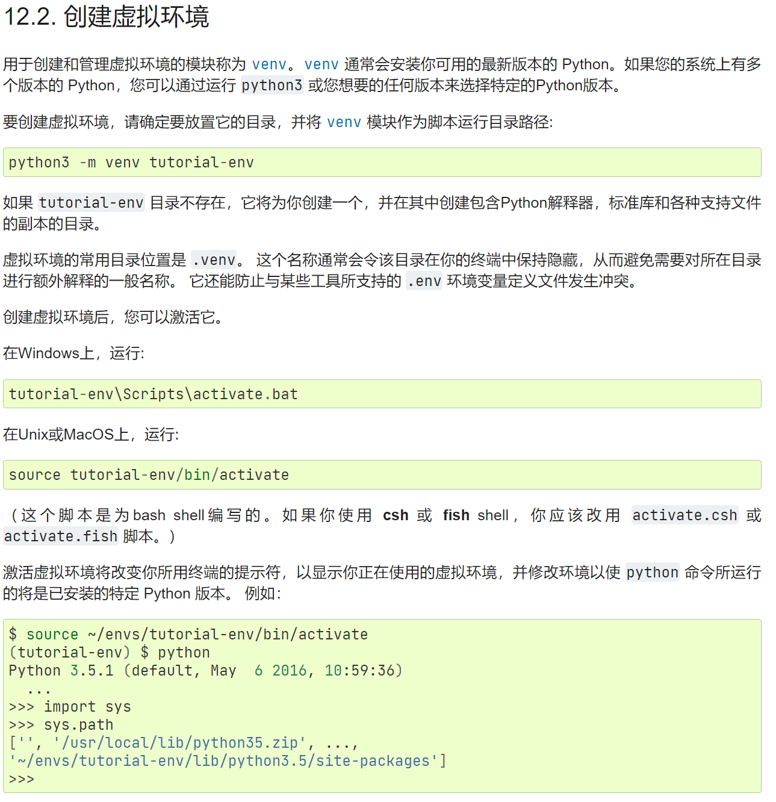
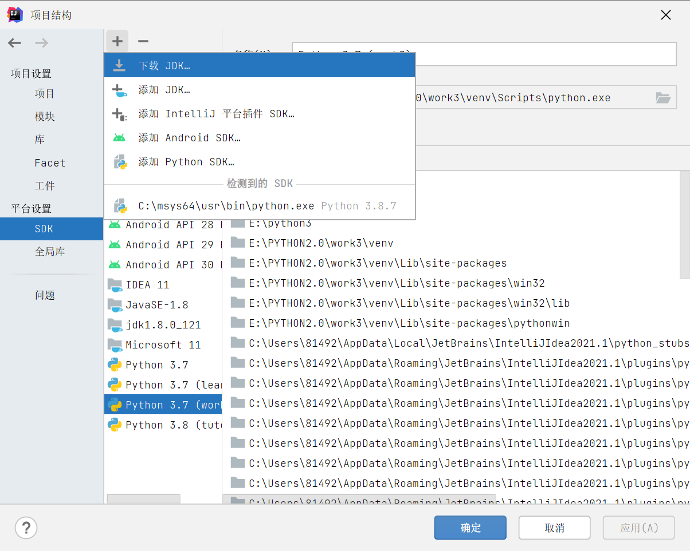
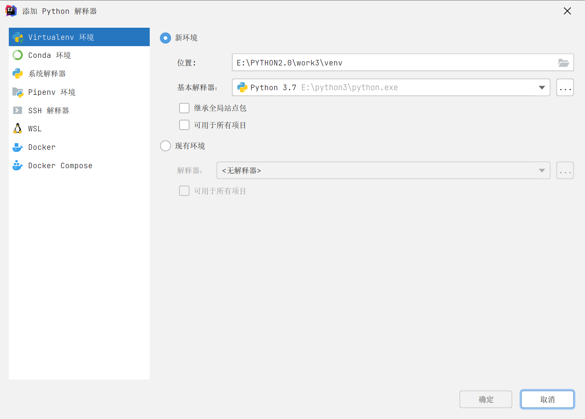
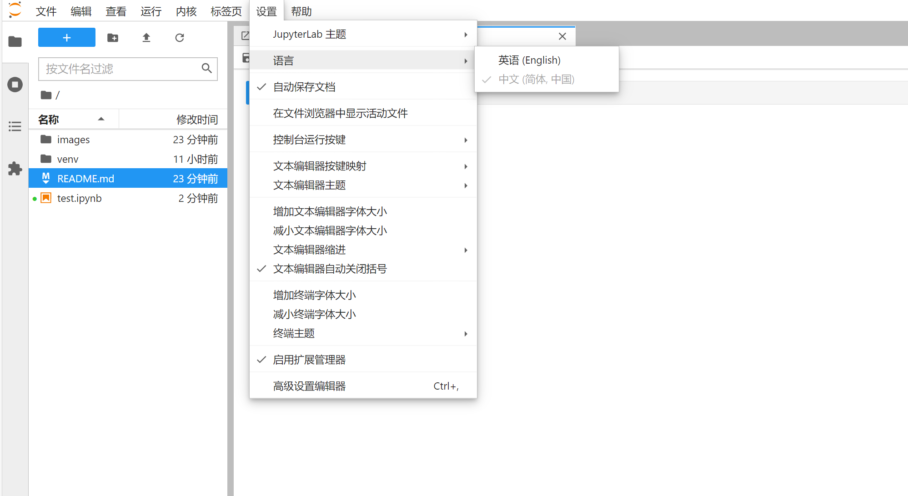
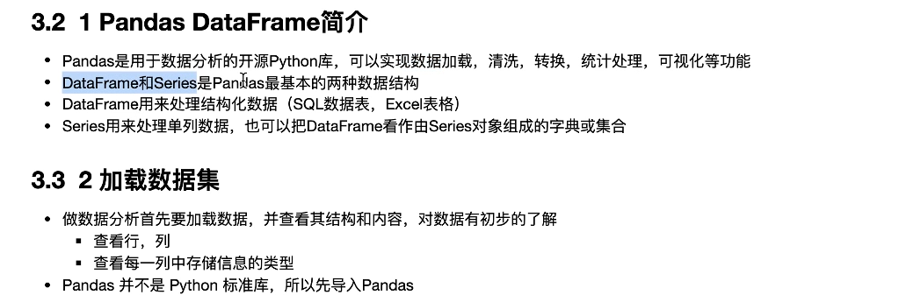
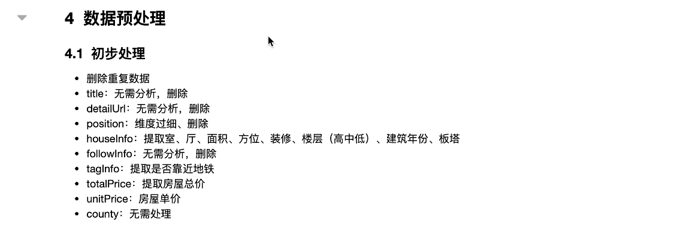

# Python Analysis
## 进入虚拟环境

## [虚拟环境Python官网相关文章](https://docs.python.org/zh-cn/3/tutorial/venv.html#creating-virtual-environments)



## IDEA创建虚拟环境




## powershell激活虚拟环境
```powershell
./Scripts/Active.ps1
```
## 运行notebook
```cmd
jupyter notebook
```
## 运行jupyter lab - 推荐
```cmd
jupyter lab
```
### [Jupyterlab安装中文语言包失败](https://cyfeng.science/2021/01/15/jupyterlab-error-when-install-chinses-language-pack/)

### [JupyterLab 3.0 正式发布，同时解决中文语言包下载不成功，汉化不成功的问题，jupyterlab-language-pack-zh-CN 安装失败解决方案](http://zsduo.com/archives/244.html)

### [jupyter lab汉化包](jupyterlab_language_pack_zh_CN-0.0.1.dev0-py2.py3-none-any.whl)

## 汉化包安装
```cmd
pip install jupyterlab_language_pack_zh_CN-0.0.1.dev0-py2.py3-none-any.whl
```

## 切换中文



## Pandas介绍



其中Series是一维的，而DataFrame是二维的！



### 仓库用来学习，数据来源于网络
